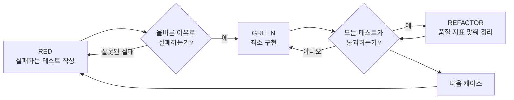

# TDD (Test-Driven Development)

> 이 스킬은 [obra/superpowers](https://github.com/obra/superpowers)의 `skills/test-driven-development`
> 스킬(RED-GREEN-REFACTOR, Iron Law, 테스트 품질 원칙)을 이 프로젝트의 언어/도구(Python 3.14,
> `unittest`)와 `CLAUDE.md`의 "구현 지침"(품질 지표, 네이밍 규칙, ISO 26262/A-SPICE 추적성)에 맞게
> 각색한 것이다. 0·4·5·6·9·10절은 이 프로젝트를 위해 추가한 내용이며, 그 외 절은 원본의 구조와 규율을
> 그대로 옮긴 것이다. 원본과 이 프로젝트 규칙이 충돌하면 `CLAUDE.md`가 우선한다(마지막 "유의사항" 참조).

## 0. 전제 조건과 산출물

- **언어/도구**: Python 3.14, 테스트 프레임워크는 `unittest`(표준 라이브러리)만 사용한다. pytest 등
  다른 프레임워크로 임의로 바꾸지 않는다. 로컬 환경에 Python 3.14가 없으면 추측하지 말고 실제 설치된
  버전을 확인한 뒤 사용자에게 알린다.
- **입력**: 구현 대상 함수/모듈의 설계 ID(`DES-...`)와 함수 계약(사전조건/사후조건/불변조건/예외,
  `detailed-design-analyst` 스킬 2절 형식)을 먼저 확인한다. 설계 산출물을 찾을 수 없으면 사용자에게
  위치를 묻고, 계약을 임의로 지어내지 않는다.
- **산출물**: 소스 파일, 그 소스와 1:1로 대응하는 단위테스트 파일(`unittest`), 품질 지표 측정
  리포트(5·6절). 작성한 단위테스트는 이후 테스트 단계에서
  `WP_Templates/Engineering/SoftwareUnitVerification/TPL-SWE4-001_SW 단위시험 명세서 템플릿.xlsx`
  (컬럼: `Test ID | Trace | Unit/Feature | Technique | Input/Precondition | Expected Result |
  Automation | Test Function`)로 옮길 수 있도록, 테스트 문서화(4절)에 그 정보를 함께 남긴다. SWE.4
  산출물 자체를 만드는 것은 이 스킬의 범위가 아니다.

## 1. 개요와 철칙(Iron Law)

먼저 테스트를 작성한다. 실패하는 것을 직접 확인한다. 그 다음 통과시키는 최소한의 코드를 작성한다.

**핵심 원칙**: 테스트가 실패하는 것을 직접 보지 않았다면, 그 테스트가 올바른 것을 검증하는지 알 수
없다.

**규칙의 형식을 어기는 것은 규칙의 정신을 어기는 것이다.**

```
구현 코드를 작성하기 전에 반드시 실패하는 테스트가 있어야 한다.
```

테스트보다 코드를 먼저 썼는가? 삭제하고 처음부터 다시 한다. "참고용으로만 남긴다", "테스트를 쓰면서
그 코드를 조금씩 가져다 쓴다", "일단 보기만 한다" 같은 예외는 없다. 삭제는 삭제다. 테스트로부터
새로 구현한다.

### 언제 적용하는가

- **항상**: 신규 기능, 버그 수정, 리팩터링, 동작 변경.
- **예외(사용자에게 먼저 확인)**: 일회성 프로토타입, 자동 생성 코드, 설정 파일.

"이번만 TDD를 건너뛰자"는 생각이 든다면 멈춘다. 그것은 합리화다(7절 참조).

## 2. RED-GREEN-REFACTOR 순환



### RED — 실패하는 테스트 작성

기대 동작을 보여주는 최소한의 테스트 하나를 작성한다. 4절의 문서화 규칙(긍정/부정 케이스, Doxygen
목적 서술)을 이 시점부터 적용한다.

<좋은 예>
```python
def testRetryReturnsResultAfterThreeAttempts(self):
    """!
    @brief 세 번째 시도에서 성공하면 재시도 로직이 그 결과를 반환하는지 검증한다.
    @case Positive
    @given 처음 두 번은 예외를 던지고 세 번째 호출에서 성공하는 함수
    @when retryOperation을 호출한다
    @then 반환값이 'success'이고 총 시도 횟수가 3회다
    @trace DES-RETRY-001
    """
    attempts = 0

    def operation():
        nonlocal attempts
        attempts += 1
        if attempts < 3:
            raise RuntimeError("fail")
        return "success"

    result = retryOperation(operation)

    self.assertEqual(result, "success")
    self.assertEqual(attempts, 3)
```
명확한 이름, 실제 동작 검증, 한 가지만 검증, 케이스 구분과 목적 서술 포함
</좋은 예>

<나쁜 예>
```python
def testRetryWorks(self):
    mockOp = MagicMock(side_effect=[RuntimeError(), RuntimeError(), "success"])
    retryOperation(mockOp)
    self.assertEqual(mockOp.call_count, 3)
```
모호한 이름, mock 호출 여부만 검증(실제 동작 아님), 목적·케이스 구분 없음
</나쁜 예>

**요구사항**: 한 가지 동작만 검증, 명확한 이름, 실제 코드 검증(불가피한 경우 외 mock 지양), 4절의
문서화 규칙 준수.

### RED 확인 — 실패를 직접 본다

**필수. 절대 건너뛰지 않는다.**

```bash
python -m unittest path.to.test_module -v
```

다음을 확인한다.
- 테스트가 (에러가 아니라) 실패하는가
- 실패 메시지가 예상한 그대로인가
- 기능이 없어서 실패하는가(오탈자 때문이 아니라)

**테스트가 통과해 버리면?** 이미 존재하는 동작을 테스트하고 있는 것이다. 테스트를 고친다.

**테스트가 에러를 내면?** 에러를 고치고, 올바르게 실패할 때까지 다시 실행한다.

### GREEN — 최소한의 코드

테스트를 통과시키는 가장 단순한 코드를 작성한다.

<좋은 예>
```python
def retryOperation(fn, maxAttempts=3):
    for attempt in range(maxAttempts):
        try:
            return fn()
        except Exception:
            if attempt == maxAttempts - 1:
                raise
```
딱 통과할 만큼만
</좋은 예>

<나쁜 예>
```python
def retryOperation(fn, maxAttempts=3, backoff="linear", onRetry=None):
    # YAGNI: 아직 요구되지 않은 옵션을 미리 구현
    ...
```
과잉 설계
</나쁜 예>

기능을 추가하거나, 다른 코드를 리팩터링하거나, 테스트 범위를 넘어 "개선"하지 않는다.

### GREEN 확인 — 통과를 직접 본다

**필수.**

```bash
python -m unittest path.to.test_module -v
```

다음을 확인한다.
- 테스트가 통과하는가
- 다른 테스트도 계속 통과하는가
- 출력이 깨끗한가(에러·경고 없음)

**테스트가 실패하면?** 테스트가 아니라 코드를 고친다.

**다른 테스트가 깨지면?** 지금 바로 고친다.

### REFACTOR — 정리

통과한 뒤에만 진행한다.
- 중복 제거
- 이름 개선
- 헬퍼 추출
- **5절의 프로젝트 품질 지표(라인수·순환복잡도·중복·주석비율·네이밍)를 6절 도구로 측정하며 맞춘다**

테스트는 계속 통과 상태를 유지한다. 새 동작을 추가하지 않는다.

### 반복

다음 케이스(다음 실패하는 테스트)로 넘어간다. 계약(설계 2절, `detailed-design-analyst` 스킬)의
정상/경계값/오류 케이스를 모두 다룰 때까지 반복한다.

## 3. 좋은 테스트

| 기준 | 좋음 | 나쁨 |
|---|---|---|
| 최소성 | 한 가지만 검증. 이름에 "그리고"가 들어가면 분리 | `testValidatesEmailAndDomainAndWhitespace` |
| 명확성 | 이름이 동작을 설명 | `testCase1` |
| 의도 표현 | 원하는 API를 보여줌 | 코드가 뭘 해야 하는지 감춤 |

테스트를 쓰거나 고칠 때는 [writing-good-tests.md](writing-good-tests.md)를 함께 참고한다 — 테스트가
정직한지 지키는 규칙: 테스트가 실패하게 만들 프로덕션 변경을 먼저 명명하기, mock이 아니라 실제 동작을
검증하기, 테스트 전용 코드는 테스트 유틸리티에만 두기, mock 하기 전에 의존성의 부작용을 이해하기.

## 4. 테스트 함수 문서화 — 긍정/부정 케이스와 Doxygen 목적 서술

모든 테스트 함수는 **반드시** 아래 형식의 Doxygen 스타일 docstring으로 시작한다. 이 규칙은 라인수
채우기용 주석이 아니라 검증 의도를 기록하는 필수 문서다(9절의 일반 Doxygen 규칙과 별개로, 테스트
함수에는 이 형식을 우선 적용한다).

```python
def test<Behavior>(self):
    """!
    @brief <이 테스트가 검증하는 동작을 한 문장으로>
    @case Positive | Negative
    @given <사전조건 또는 입력 상태>
    @when <실행하는 동작>
    @then <기대 결과 — 정량 기준으로>
    @trace <설계 ID(DES-...) 및/또는 요구사항 ID>
    """
```

- **`@case`는 반드시 `Positive`(긍정 케이스) 또는 `Negative`(부정 케이스) 중 하나로 명시한다.**
  - `Positive`: 유효한 입력·정상 경로에서 함수 계약의 사후조건을 만족하는지 검증(정상 동작, 유효한
    경계값 포함).
  - `Negative`: 사전조건 위반, 잘못된 입력, 예외/오류 상황에서 계약이 정의한 오류 처리(예외, 오류
    코드, 상태 변화)가 실제로 일어나는지 검증.
  - 경계값 테스트는 그 값이 유효 범위 안이면 `Positive`, 범위를 벗어나면 `Negative`로 분류한다.
- 함수 계약(설계 2절)의 모든 사전조건·예외 경로마다 최소 하나의 `Negative` 테스트가 있어야 한다.
  `Positive` 케이스만으로 계약을 "완료"로 보고하지 않는다.
- `@trace`는 10절 추적성 규칙과 연결된다 — 값을 지어내지 말고 실제 설계/요구사항 ID를 인용한다.
- 이 docstring은 3절(최소성·명확성)과 [writing-good-tests.md](writing-good-tests.md)의 "무엇을 검증
  하는지 이름 붙이기" 원칙을 실행 가능한 형식으로 강제하는 것이다 — 형식만 채우고 내용이 비어 있으면
  (예: `@then 정상 동작한다`처럼 모호하게 쓰면) 이 규칙을 지킨 것이 아니다.

## 5. 프로젝트 품질 지표 — 반드시 준수 (`CLAUDE.md` "구현 지침"·"단위 테스트 지침")

| 지표 | 기준 | 비고 |
|---|---|---|
| 함수 순수 코드 라인 수 | 50라인 이하 | 주석·빈 줄 제외한 실행 라인 기준 |
| 함수 순환복잡도(Cyclomatic Complexity) | 10 이하 | 6절 도구로 측정 |
| 중복 코드 | 최대 7라인까지 허용 | 8라인 이상 동일/유사 코드 블록 금지 |
| 주석 비율 | 전체 코드의 20% 이상, Doxygen 방식 | 9절 참조 |
| 함수명·변수명 | 3글자 이상, 낙타 표기법(camelCase) | 클래스명은 기존 파이썬 관례(PascalCase)를 따르되 프로젝트에서 별도 지시가 있으면 그에 따른다 |
| **단위(Branch) 커버리지** | **100%** | 이 프로젝트의 단위 테스트는 TDD로 대체하며, 모든 분기(if/else, 예외 경로 포함)가 최소 1회 이상 실행되어야 한다. 6절 도구로 측정 |

- Branch 커버리지 100%는 "이 함수의 모든 분기마다 그 분기를 실행하는 `Positive`/`Negative` 테스트가
  4절 기준으로 최소 하나씩 있다"와 같은 뜻이다 — 4절의 `Negative` 테스트 의무화 규칙과 이 지표는
  서로를 강제한다. 별도로 두 규칙을 각각 만족시키려 하지 말고 함께 설계한다.
- 이 지표는 함수/모듈 **내부** 분기 커버리지다. 컴포넌트 **간** 호출 경로(Call 커버리지)와 SW 전체
  요구사항 기준 블랙박스 검증은 이 스킬의 범위가 아니다(마지막 "관련 스킬과의 경계" 참조).

- 리팩터링 후에도 위 지표를 넘으면 함수를 책임 단위로 분리하거나 조건 로직을 단순화한다. 지표를 맞추기
  위해 주석을 의미 없이 채우거나 코드를 인위적으로 여러 줄로 쪼개는 형식적 대응은 쓰지 않는다.
- 지표 측정이 불가능한 상황(도구 미설치 등)에서는 수치를 추측해 "통과"로 보고하지 않는다. 6절에 따라
  실제로 측정하거나, 측정하지 못했음을 리포트에 명시한다.

## 6. 측정 도구 — 실행 가능한 검증만 사용

프로젝트에 실제로 설치되어 있는 오픈소스 도구로 측정한다(`requirements.txt`/`pyproject.toml`/이미
설치된 패키지를 확인). **실제 설치 여부를 먼저 확인하지 않고 명령을 실행하거나 결과를 지어내지 않는다.**

| 지표 | 예시 도구 | 예시 명령 |
|---|---|---|
| 순환복잡도 | `radon`(cc), 또는 `flake8` + `mccabe` | `radon cc <파일> -s` |
| 함수 라인 수 | `radon raw`, 또는 `pylint`(`too-many-lines` 계열) | `radon raw <파일>` |
| 중복 코드 | `pylint --disable=all --enable=duplicate-code` | `pylint --disable=all --enable=duplicate-code <경로>` |
| **Branch(분기) 커버리지 — 100% 목표** | `coverage`(`--branch` 옵션) | `coverage run --branch -m unittest && coverage report -m` |

- 위 도구가 없다면 사용자에게 설치 여부를 확인하고, 설치 전까지는 "측정 미수행 — 도구 미확인"으로
  리포트에 남긴다. 임의로 다른 도구를 설치하지 않는다(사용자 확인 후 진행).
- 측정은 REFACTOR 단계마다(2절) 수행해 지표 위반을 조기에 발견한다.
- Branch 커버리지가 100% 미만이면 놓친 분기를 실행하는 테스트(대개 `Negative` 케이스)를 추가한다.
  4절 규칙에 따라 이미 모든 예외 경로에 `Negative` 테스트를 뒀다면 자연히 100%에 수렴한다 — 100%를
  채우려고 단정 없는 호출만 하는 테스트를 추가하지 않는다(뮤테이션 점검, [writing-good-
  tests.md](writing-good-tests.md) 참조).

## 7. 흔한 합리화

| 핑계 | 실제로는 |
|---|---|
| "너무 간단해서 테스트 필요 없다" | 간단한 코드도 깨진다. 테스트는 30초면 쓴다. |
| "나중에 테스트 쓸게" | 나중에 쓴 테스트는 바로 통과해버려 아무것도 증명하지 못한다. 틀린 것을 검증하거나, 구현을 검증하거나, 잊어버린 경계 케이스를 놓친다. 실패를 본 적이 없으니 버그를 잡을 수 있다는 증거가 없다. |
| "테스트 후 작성도 목적은 같다(형식이 아니라 정신)" | 사후 테스트는 "이 코드가 뭘 하는지"에 답하고, 사전 테스트는 "뭘 해야 하는지"에 답한다. 사후 테스트는 이미 쓴 코드에 편향돼 기억나는 케이스만 검증한다. 실패를 증명하지 못한 커버리지일 뿐이다. |
| "이미 수동으로 테스트했다" | 수동 테스트는 무엇을 확인했는지 기록이 없고, 코드가 바뀌면 다시 돌릴 수 없으며, 압박 속에서 케이스를 빠뜨리기 쉽다. "해보니 됐다" ≠ 충분한 검증. |
| "이미 쓴 코드를 지우는 건 낭비다" | 매몰비용 오류다 — 그 시간은 이미 썼다. 실제 선택은 TDD로 다시 짜는 것(신뢰 높음)과 신뢰할 수 없는 코드에 나중에 테스트를 붙이는 것(신뢰 낮음, 버그 가능성 높음) 중 하나다. |
| "참고용으로 남기고 테스트부터 쓰겠다" | 결국 그 코드를 가져다 쓰게 된다. 그것은 사후 테스트다. |
| "탐색이 먼저 필요하다" | 좋다. 탐색 코드는 버리고 TDD로 다시 시작한다. |
| "테스트하기 어려우면 설계가 이상한 것" | 테스트가 어렵다는 신호를 들어라. 테스트하기 어려우면 쓰기도 어렵다. |
| "TDD는 느리다" | TDD가 실용적인 길이다. 커밋 전에 버그를 잡고, 회귀를 막고, 두려움 없이 리팩터링하게 해준다. "실용적" 지름길은 결국 프로덕션에서 디버깅하는 것 — 더 느리다. |
| "기존 코드에는 테스트가 없었다" | 지금 그 코드를 개선하는 중이다. 기존 코드에도 테스트를 추가한다. |

"이번만 건너뛰자"는 생각이 들면 멈춘다.

## 8. 위험 신호 — 멈추고 다시 시작

- 테스트보다 코드를 먼저 썼다
- 구현 후에 테스트를 썼다
- 테스트가 바로 통과해버렸다
- 왜 실패했는지 설명할 수 없다
- 테스트를 "나중에" 추가했다
- "이번만 예외로" 라고 합리화하고 있다
- "이미 수동으로 테스트했다"
- "참고용으로 남기겠다" 또는 "기존 코드를 가져다 쓰겠다"
- "이미 X시간 썼으니 지우는 건 아깝다"
- "TDD는 교조적이다, 나는 실용적으로 하는 것뿐이다"

**이 중 하나라도 해당하면: 코드를 지우고 TDD로 다시 시작한다.**

## 9. Doxygen 주석 규칙 (구현 코드 전반)

- 모든 공개 함수/클래스 상단에 Doxygen이 인식하는 스타일로 문서화한다(`@brief`, `@param`, `@return`,
  `@throws` 등).
- 주석 내용은 함수 계약(사전조건/사후조건/예외)을 요약해야 하며, 코드를 그대로 옮겨 적는 무의미한
  주석으로 20% 비율을 채우지 않는다.
- 테스트 함수는 4절의 전용 형식(`@brief`/`@case`/`@given`/`@when`/`@then`/`@trace`)을 따른다.
- 전체 코드 대비 주석 비율(20% 이상, 5절)은 6절 도구(예: `radon raw`의 comment 라인 통계) 또는 동등한
  방법으로 실제 측정하고, 리포트에 수치를 남긴다.

## 10. 추적성

- 각 소스 파일/함수 상단 주석과 대응 테스트 파일 상단에 구현 대상 설계 ID(`DES-...`)와 상위 요구사항
  ID를 명시한다. 테스트 함수 단위의 추적은 4절 `@trace` 태그로 기록한다.
- 구현이 완료되면 `ENG-TRC-001` 양방향 추적 매트릭스(`detailed-design-analyst`/`requirements-analyst`
  스킬 7·8절)의 `Code`(및 해당되면 `SWE.4`) 열을 갱신하도록 사용자 또는 담당 에이전트에게 알린다(이
  스킬 자체는 XLSX 편집 권한을 요구하지 않는다).

## 11. 예시 — 버그 수정

**버그**: 빈 이메일이 통과됨

**RED**
```python
def testSubmitRejectsEmptyEmail(self):
    """!
    @brief 이메일이 빈 문자열이면 제출이 거부되는지 검증한다.
    @case Negative
    @given email 필드가 빈 문자열인 폼 데이터
    @when submitForm을 호출한다
    @then 반환된 error가 'Email required'다
    @trace DES-FORM-003
    """
    result = submitForm({"email": ""})
    self.assertEqual(result.get("error"), "Email required")
```

**RED 확인**
```bash
$ python -m unittest -v
FAIL: expected 'Email required', got None
```

**GREEN**
```python
def submitForm(data):
    if not data.get("email", "").strip():
        return {"error": "Email required"}
    # ...
```

**GREEN 확인**
```bash
$ python -m unittest -v
OK
```

**REFACTOR**
여러 필드에 검증이 필요하면 검증 로직을 헬퍼로 추출하고 5·6절 지표를 확인한다.

## 12. 완료 전 점검 목록

- [ ] 새 함수/메서드마다 테스트가 있다
- [ ] 각 테스트가 실패하는 것을 직접 확인했다
- [ ] 각 테스트가 예상된 이유로 실패했다(기능 없음이지, 오탈자가 아님)
- [ ] 각 테스트를 통과시키는 최소 코드를 작성했다
- [ ] 모든 테스트가 통과한다
- [ ] 출력이 깨끗하다(에러·경고 없음)
- [ ] 테스트가 실제 코드를 검증한다(불가피한 경우만 mock)
- [ ] 경계값과 오류 케이스를 다뤘다
- [ ] 모든 테스트 함수에 `@brief`/`@case`(Positive/Negative)/`@given`/`@when`/`@then`/`@trace`가 있다
- [ ] 5절 품질 지표(Branch 커버리지 100% 포함)를 6절 도구로 측정했고 기준을 만족한다(또는 미측정
      사유를 남겼다)
- [ ] `ENG-TRC-001` 갱신이 필요함을 알렸다

모든 항목을 체크할 수 없다면 TDD를 건너뛴 것이다. 처음부터 다시 한다.

## 13. 막혔을 때

| 문제 | 해결 |
|---|---|
| 테스트를 어떻게 써야 할지 모르겠다 | 원하는 API를 먼저 적어본다. 단정문부터 쓴다. 사용자에게 물어본다. |
| 테스트가 너무 복잡하다 | 설계가 너무 복잡한 것이다. 인터페이스를 단순화한다. |
| 모든 것을 mock 해야 한다 | 코드가 지나치게 결합돼 있다. 의존성 주입을 사용한다. |
| 테스트 준비(setup)가 방대하다 | 헬퍼로 추출한다. 그래도 복잡하면 설계를 단순화한다. |

## 14. 디버깅과의 연계

버그를 발견했는가? 그 버그를 재현하는 실패하는 테스트를 먼저 쓴다. TDD 순환을 따른다. 테스트가 수정을
증명하고 회귀를 막는다.

테스트 없이 버그를 고치지 않는다.

## 최종 규칙

```
구현 코드 → 테스트가 존재하고 먼저 실패했어야 한다
그렇지 않으면 → TDD가 아니다
```

예외는 사용자(프로젝트 담당자)의 승인 없이는 없다.

## 관련 스킬과의 경계

이 스킬은 **함수/모듈 내부**(단위) 수준만 다룬다. 아래는 이 스킬이 다루지 않는 것과, 대신 사용할
스킬이다 — 같은 내용을 이 스킬에 다시 정의하지 않는다.

| 다루지 않는 것 | 대신 사용하는 스킬(A-SPICE 프로세스) |
|---|---|
| 컴포넌트 간 인터페이스·호출 경로 검증, Function/Call 커버리지 | `integration-test-analyst`(SWE.5) |
| SW 전체를 요구사항 기준으로 하는 블랙박스 검증, ISO/IEC 25000 비기능 분류 | `sw-system-test`(SWE.6) |
| 설계 자체(함수 계약, 알고리즘)의 정의 | `detailed-design-analyst`(SWE.3) |

이 스킬의 단위테스트는 위 상위 테스트 단계의 입력이 될 수 있지만(0절), 그 단계의 산출물을 이 스킬이
대신 만들지 않는다.

## 유의사항

- 확인할 수 없는 사항(도구 설치 여부, 상위 설계 근거, Python 3.14 가용성 등)은 추측하지 말고 "확인
  필요"로 남긴다.
- 이 스킬의 원본은 언어에 종속되지 않는 일반 TDD 규율([obra/superpowers](https://github.com/obra/superpowers))이며, 0·4·5·6·9·10절(전제조건, 긍정/부정 케이스·Doxygen 테스트 목적, 품질 지표,
  측정 도구, Doxygen 주석, 추적성)은 이 프로젝트를 위해 추가한 것이다. `CLAUDE.md`의 구현 지침이 이
  스킬의 다른 관행보다 항상 우선한다. `CLAUDE.md`가 개정되면 5·9절을 그 내용에 맞춰 갱신한다.
